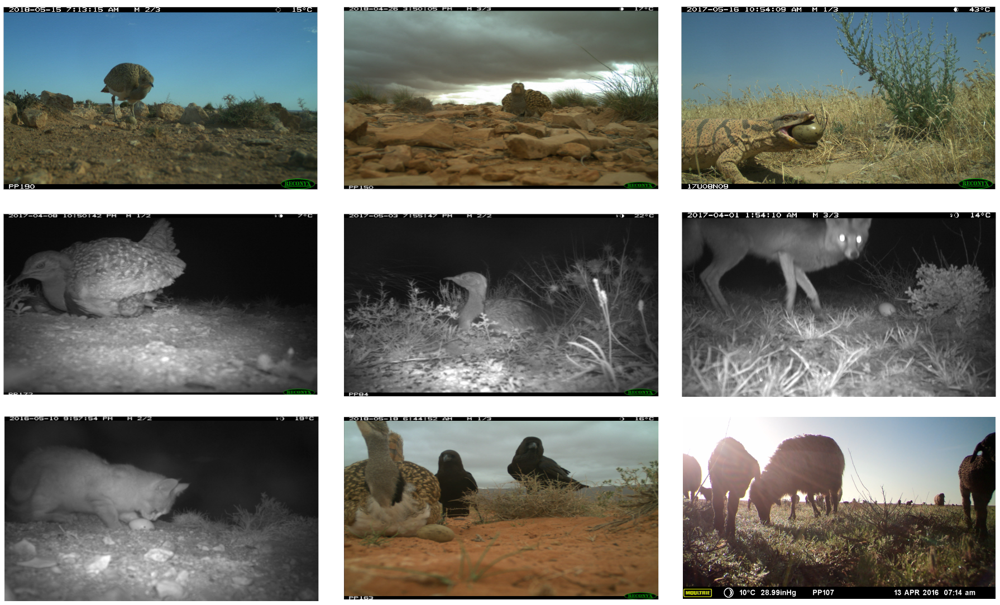

# HBID24K: A New Benchmark Dataset for Vulnerable Houbara Bustard and Intruder Detection

Monitoring the nesting attempts of the vulnerable Houbara Bustard, a bird of ecological and cultural significance, and detecting intruders
threatening their habitat are critical for wildlife conservation. Deep learning-based object detection offers an efficient solution for
automating large-scale monitoring, yet its application to Houbara research has been hindered by the lack of comprehensive datasets. To
address this gap, we present a new dataset of 24,318 camera-trap images, including 15,070 Houbara Bustard images and 9,248 intruder
animal images, all annotated with bounding boxes. Collected between 2011 and 2023 using 14 camera models at various times of the
day, this dataset provides unprecedented diversity and complexity, enabling studies on Houbara and other bustard species in similar
habitats. We benchmarked 10 state-of-the-art object detection models, demonstrating that YOLOv10 outperforms others across evaluation
metrics. This dataset represents a significant contribution to wildlife monitoring and conservation, supporting vulnerable Houbara Bustard
research while offering a foundation for broader applications by providing a valuable resource for researchers and practitioners.

# Resources for Dataset, Annotation Tool, and Benchmarking Techniques

| **Technique**          | **Code Link**                                                                 | **Publication Reference**                                                                                                      |
|-------------------------|------------------------------------------------------------------------------|------------------------------------------------------------------------------------------------------------------------------|
| LabelMe Annotation Tool | [GitHub Link](https://github.com/wkentaro/labelme)                          | Russell et al., "LabelMe: A Database and Web-Based Tool for Image Annotation"                                                |
| Faster R-CNN            | [GitHub Link](https://github.com/rbgirshick/py-faster-rcnn)                | Ren et al., "Faster R-CNN: Towards Real-Time Object Detection with Region Proposal Networks" (2015)                         |
| Cascade R-CNN           | [GitHub Link](https://github.com/open-mmlab/mmdetection/tree/main/configs/cascade_rcnn) | Cai and Vasconcelos, "Cascade R-CNN: Delving into High Quality Object Detection" (2018)                                     |
| RetinaNet               | [GitHub Link](https://github.com/facebookresearch/detectron2)              | Lin et al., "Focal Loss for Dense Object Detection" (2017)                                                                   |
| FCOS                    | [GitHub Link](https://github.com/tianzhi0549/FCOS)                         | Tian et al., "FCOS: Fully Convolutional One-Stage Object Detection" (2019)                                                  |
| RepPoints               | [GitHub Link](https://github.com/microsoft/RepPoints)                      | Yang et al., "RepPoints: Point Set Representation for Object Detection" (2019)                                              |
| ATSS                    | [GitHub Link](https://github.com/sfzhang15/ATSS)                           | Zhang et al., "Bridging the Gap Between Anchor-Based and Anchor-Free Detection via Adaptive Training Sample Selection" (2020)|
| DETR                    | [GitHub Link](https://github.com/facebookresearch/detr)                    | Carion et al., "End-to-End Object Detection with Transformers" (2020)                                                       |
| Deformable DETR         | [GitHub Link](https://github.com/fundamentalvision/Deformable-DETR)        | Zhu et al., "Deformable DETR: Deformable Transformers for End-to-End Object Detection" (2021)                               |
| Sparse R-CNN            | [GitHub Link](https://github.com/PeizeSun/SparseR-CNN)                     | Sun et al., "Sparse R-CNN: End-to-End Object Detection with Learnable Proposals" (2021)                                     |
| YOLOv10                 | [GitHub Link](https://github.com/THU-MIG/yolov10)                          | Wang et al., "YOLOv10: Real-Time End-to-End Object Detection" (2024)                                                        |

The sample images from the dataset

Multi-class detection of Houbara and Other species.

Binary detection of Houbara and intruders
